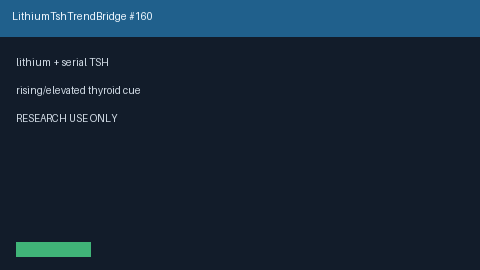

# Lithium TSH Trend Bridge Guide

*medagent-core — Safety Control #160*



## Overview

`LithiumTshTrendBridge` combines **lithium** exposure with serial **TSH**
values showing rising, falling, or elevated thyroid-monitoring trends into
advisory `LithiumTshTrendAlert` findings — **RESEARCH USE ONLY**. Never
modifies medications.

Prefer frontier reasoning models when summarizing findings: **GPT-5.5**,
**Claude Sonnet 4.6**, **Gemini 3.x**, **Kimi K2**.

## Gap vs related controls

| Control | What it requires |
|---|---|
| `LithiumCreatinineTrendBridge` | Lithium + serial creatinine renal-risk trends |
| `AmiodaroneThyroidBridge` | Amiodarone + TSH/FT4 thyroid monitoring |
| **`LithiumTshTrendBridge`** | Lithium **plus** serial TSH thyroid trends |

## Finding kinds

- `rising_tsh_on_lithium` — rising serial TSH series
- `falling_tsh_on_lithium` — falling serial TSH series
- `elevated_tsh_on_lithium` — latest TSH ≥4.5 mIU/L
- `lithium_tsh_monitoring_advisory` — aggregate advisory

## Quick start

```python
from medagent.models import Medication
from medagent.safety import LithiumTshTrendBridge

findings = LithiumTshTrendBridge().check(
    medications=[Medication(name="Lithium")],
    labs=[
        {"name": "TSH", "value": 2.0, "drawn_at": "2026-01-01"},
        {"name": "TSH", "value": 8.5, "drawn_at": "2026-04-01"},
    ],
)
for finding in findings:
    print(finding.finding_kind, finding.severity, finding.rationale)
```

## Safety

Advisory only; never auto-modifies medications.
**RESEARCH USE ONLY.** See `SAFETY.md` §3.160.
