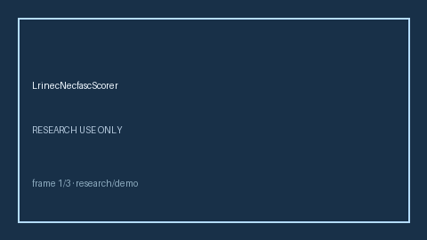

# LrinecNecfascScorer Guide



Research-only advisory scorer. Closes the MDCalc / IDSA / EHR LRINEC necrotizing fasciitis score gap.

Optional later polish via **GPT-5.5 / Claude Sonnet 4.6 / Gemini 3.x / Kimi K2**.

Distinct from `CentorStrepPharyngitisScorer / SofaOrganFailureScorer`.

## Usage

```python
from medagent.safety.lrinec_necfasc_scorer import (
    LrinecNecfascScorer,
    LrinecNecfascFactors,
)

findings = LrinecNecfascScorer().check(LrinecNecfascFactors())
print(findings[0].band, findings[0].rationale)
```

## Safety

RESEARCH USE ONLY. Never modifies medications. No HTTP. See `SAFETY.md` #195.
