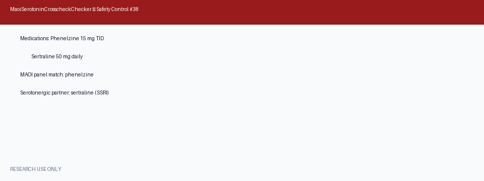

# MAOI + Serotonergic Cross-Check Guide

*medagent-core — Safety Control #38*



## Overview

`MaoiSerotoninCrosscheckChecker` provides a focused **MAOI × serotonergic
cross-check** that complements `SerotoninSyndromeChecker` (Safety Control #14).
While the serotonin-syndrome checker flags any two or more co-prescribed
serotonergic agents, this checker explicitly pairs each MAOI with each
concurrent non-MAOI serotonergic medication.

Findings are advisory `MaoiSerotoninRisk` records — **RESEARCH USE ONLY** —
and the checker is exported from `medagent.safety`.

## MAOI panel

| Agent | Notes |
|---|---|
| phenelzine | irreversible MAOI |
| tranylcypromine | irreversible MAOI |
| isocarboxazid | irreversible MAOI |
| selegiline | MAOI (dose-dependent) |
| rasagiline | MAOI |
| linezolid | reversible MAOI (antibiotic) |

## Serotonergic partner classes

| Class | Example agents |
|---|---|
| SSRI | fluoxetine, sertraline, paroxetine, citalopram, escitalopram |
| SNRI | venlafaxine, duloxetine, desvenlafaxine |
| Triptan | sumatriptan, rizatriptan, zolmitriptan, eletriptan |
| Opioid | tramadol, tapentadol, meperidine, methadone, fentanyl |
| Other | trazodone, mirtazapine, buspirone, dextromethorphan, lithium |

Every MAOI × serotonergic pair yields **CRITICAL** severity. Medication
matching is whole-token based.

## Quick start

```python
from medagent.models import Medication
from medagent.safety import MaoiSerotoninCrosscheckChecker

findings = MaoiSerotoninCrosscheckChecker().check(
    medications=[
        Medication(name="Phenelzine 15 mg TID"),
        Medication(name="Sertraline 50 mg daily"),
        Medication(name="Sumatriptan 50 mg PRN"),
    ],
)
for finding in findings:
    print(
        finding.agent,
        finding.partner_agent,
        finding.partner_drug_class,
        finding.severity,
        finding.rationale,
    )
```

## Reasoning stack notes

When this checker's findings are summarized by an upstream reasoning / routing
layer, prefer current frontier models for clinical prose:

- **GPT-5.5**
- **Claude Sonnet 4.6**
- **Gemini 3.x**
- **Kimi K2**

The checker itself is deterministic and does not call an LLM.

## See also

- [SAFETY.md §3.38](../../SAFETY.md)
- [README safety controls table](../../README.md)
- Serotonin syndrome (broader): `safety/serotonin_syndrome_checker.py`
