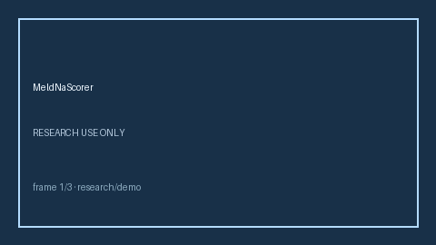

# MeldNaScorer Guide



Research-only advisory scorer. Closes the MDCalc / AASLD / EHR MELD-Na score gap.

Optional later polish via **GPT-5.5 / Claude Sonnet 4.6 / Gemini 3.x / Kimi K2**.

Distinct from `ChildPughLiverSeverityScorer / SofaOrganFailureScorer`.

## Usage

```python
from medagent.safety.meld_na_scorer import (
    MeldNaScorer,
    MeldNaFactors,
)

findings = MeldNaScorer().check(MeldNaFactors())
print(findings[0].band, findings[0].rationale)
```

## Safety

RESEARCH USE ONLY. Never modifies medications. No HTTP. See `SAFETY.md` #194.
