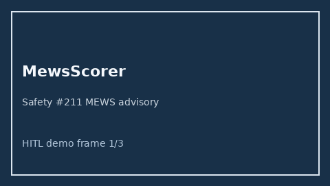

# MewsScorer Guide



Research-only advisory scorer (Safety #211). Never modifies medications.

Gap vs MDCalc / NICE / EHR MEWS. Distinct from `News2EarlyWarningScorer / VitalsTriageChecker`.

Optional polish via **GPT-5.5 / Claude Sonnet 4.6 / Gemini 3.x / Kimi K2**.

## Usage

```python
from medagent.safety.mews_scorer import (
    MewsFactors,
    MewsScorer,
)

findings = MewsScorer().check(MewsFactors())
assert "RESEARCH USE ONLY" in findings[0].rationale
print(findings[0].band, findings[0].score)
```

## Safety

RESEARCH USE ONLY. See `SAFETY.md`.
