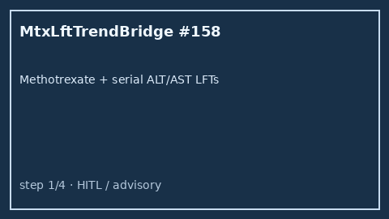

# Methotrexate LFT Trend Bridge Guide

*medagent-core — Safety Control #158*



## Overview

`MtxLftTrendBridge` combines **methotrexate** exposure with serial **ALT/AST**
LFT values showing rising or elevated trends into advisory
`MtxLftTrendAlert` findings — **RESEARCH USE ONLY**. Never modifies
medications.

Prefer frontier reasoning models when summarizing findings: **GPT-5.5**,
**Claude Sonnet 4.6**, **Gemini 3.x**, **Kimi K2**.

## Gap vs related controls

| Control | What it requires |
|---|---|
| `MtxFolateChecker` | Methotrexate without folate co-therapy |
| `MtxTmpsmxChecker` | Methotrexate × TMP-SMX toxicity pairs |
| `StatinLftTrendBridge` | Statin + serial ALT/AST hepatotoxicity cues |
| **`MtxLftTrendBridge`** | Methotrexate **plus** serial ALT/AST hepatotoxicity cues |

## Finding kinds

- `rising_alt_on_mtx` / `rising_ast_on_mtx` — rising serial LFT series
- `elevated_lft_on_mtx` — latest LFT ≥80 U/L (critical ≥200)
- `mtx_hepatotoxicity_advisory` — aggregate advisory

## Quick start

```python
from medagent.models import Medication
from medagent.safety import MtxLftTrendBridge

findings = MtxLftTrendBridge().check(
    medications=[Medication(name="Methotrexate")],
    labs=[
        {"name": "ALT", "value": 42.0, "drawn_at": "2026-01-01"},
        {"name": "ALT", "value": 128.0, "drawn_at": "2026-01-15"},
    ],
)
for finding in findings:
    print(finding.finding_kind, finding.severity, finding.rationale)
```

## Safety

Advisory only; never auto-modifies medications.
**RESEARCH USE ONLY.** See `SAFETY.md` §3.158.
