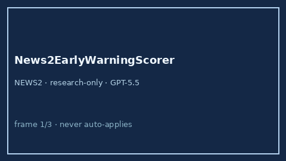

# News2EarlyWarningScorer Guide



Research-only advisory clinical score (Safety #179). Never modifies medications.

Prefer **GPT-5.5 / Claude Sonnet 4.6 / Gemini 3.x / Kimi K2** for narratives.

Distinct from `VitalsTriageChecker / QSofaSepsisScreenScorer`.

## Usage

```python
from medagent.safety.news2_early_warning_scorer import (
    News2EarlyWarningFactors,
    News2EarlyWarningScorer,
)

findings = News2EarlyWarningScorer().check(News2EarlyWarningFactors())
assert findings[0].rationale.startswith("RESEARCH USE ONLY")
```
