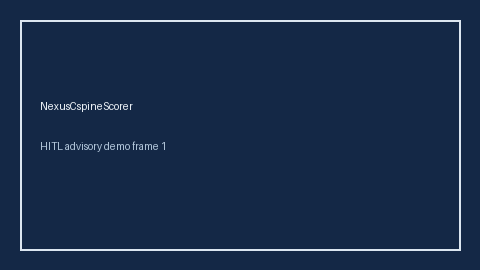

# NexusCspineScorer Guide



Research-only advisory scorer (Safety #210). Never modifies medications.

Gap vs MDCalc / ACEP / EHR NEXUS C-spine rule. Distinct from `CanadianCspineRuleScorer / OttawaAnkleRuleScorer`.

Optional polish via **GPT-5.5 / Claude Sonnet 4.6 / Gemini 3.x / Kimi K2**.

## Usage

```python
from medagent.safety.nexus_cspine_scorer import (
    NexusCspineFactors,
    NexusCspineScorer,
)

findings = NexusCspineScorer().check(NexusCspineFactors())
assert "RESEARCH USE ONLY" in findings[0].rationale
print(findings[0].band, findings[0].score)
```

## Safety

RESEARCH USE ONLY. See `SAFETY.md`.
