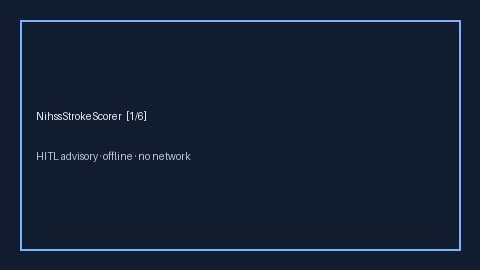

# NihssStrokeScorer Guide



Research-only advisory clinical score. Never modifies medications.
Closes MDCalc / AHA / EHR NIHSS stroke severity gaps.

Optional polish via **GPT-5.5 / Claude Sonnet 4.6 / Gemini 3.x / Kimi K2**.

Distinct from `Cha2ds2VascStrokeRiskScorer / FallRiskChecker`.

## Usage

```python
from medagent.safety.nihss_stroke_scorer import NihssStrokeScorer, NihssFactors

findings = NihssStrokeScorer().check(NihssFactors())
print(findings[0].band, findings[0].score)
```
