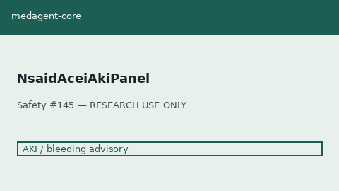

# NSAID + ACEI/ARB AKI Panel Guide

*medagent-core — Safety Control #145*



## Overview

`NsaidAceiAkiPanel` aggregates concurrent **NSAID + ACEI/ARB/ARNI** into
panel-level `NsaidAceiAkiPanelRisk` findings — **RESEARCH USE ONLY**. Never
modifies medications.

Prefer frontier reasoning models when summarizing findings: **GPT-5.5**,
**Claude Sonnet 4.6**, **Gemini 3.x**, **Kimi K2**.

## Gap vs TripleWhammyChecker

| Control | What it requires / emits |
|---|---|
| `TripleWhammyChecker` | All three classes (NSAID + ACEI/ARB + diuretic); per-triad findings |
| **`NsaidAceiAkiPanel`** | Dual NSAID+ACEI/ARB even **without** diuretic; panel aggregates; escalates if diuretic present |

## Finding kinds

- `nsaid_acei_dual_aki_panel` — NSAID + ACEI/ARB present (HIGH; CRITICAL if diuretic)
- `nsaid_acei_diuretic_escalation` — diuretic also present (CRITICAL)
- `multi_nsaid_on_acei_arb` — ≥ 2 NSAIDs with ACEI/ARB

## Quick start

```python
from medagent.models import Medication
from medagent.safety import NsaidAceiAkiPanel

findings = NsaidAceiAkiPanel().check(
    medications=[
        Medication(name="Ibuprofen"),
        Medication(name="Lisinopril"),
    ],
)
for finding in findings:
    print(finding.finding_kind, finding.severity, finding.rationale)
```

## Safety

Advisory only; never auto-modifies medications.
**RESEARCH USE ONLY.** See `SAFETY.md` §3.145.
