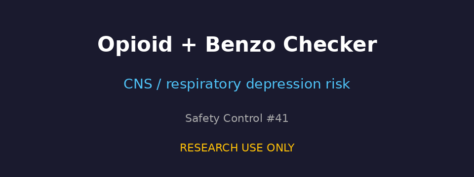

# Opioid + Benzodiazepine/Z-Drug CNS Depression Checker Guide

*medagent-core — Safety Control #41*



## Overview

`OpioidBenzoChecker` flags **opioid co-prescription with benzodiazepines or
Z-drug hypnotics** — combinations that markedly increase the risk of profound
CNS and respiratory depression, overdose, and death. It complements
`OpioidMedChecker` (MED summation) and `TaperScheduleChecker` (taper advisory)
with a focused opioid × sedative-hypnotic cross-check.

Findings are advisory `OpioidBenzoRisk` records — **RESEARCH USE ONLY** —
and the checker is exported from `medagent.safety`.

## Opioid panel

| Agent | Notes |
|---|---|
| oxycodone | opioid analgesic |
| hydrocodone | opioid analgesic |
| morphine | opioid analgesic |
| fentanyl | potent synthetic opioid |
| hydromorphone | opioid analgesic |
| codeine | opioid analgesic |
| tramadol | weak opioid |
| methadone | long-acting opioid |

## Benzodiazepine / Z-drug partners

| Class | Example agents |
|---|---|
| benzodiazepine | alprazolam, lorazepam, diazepam, clonazepam, midazolam, temazepam |
| Z-drug | zolpidem, zopiclone, eszopiclone |

Every opioid × benzodiazepine/Z-drug pair yields **CRITICAL** severity.
Medication matching is whole-token based.

## Quick start

```python
from medagent.models import Medication
from medagent.safety import OpioidBenzoChecker

findings = OpioidBenzoChecker().check(
    medications=[
        Medication(name="Oxycodone 5 mg QID"),
        Medication(name="Lorazepam 1 mg BID"),
        Medication(name="Zolpidem 10 mg nightly"),
    ],
)
for finding in findings:
    print(
        finding.agent,
        finding.partner_agent,
        finding.partner_drug_class,
        finding.severity,
        finding.rationale,
    )
```

## Reasoning stack notes

When this checker's findings are summarized by an upstream reasoning / routing
layer, prefer current frontier models for clinical prose:

- **GPT-5.5**
- **Claude Sonnet 4.6**
- **Gemini 3.x**
- **Kimi K2**

The checker itself is deterministic and does not call an LLM.

## See also

- [SAFETY.md §3.41](../../SAFETY.md)
- [README safety controls table](../../README.md)
- Opioid MED: `safety/opioid_med_checker.py`
- Taper schedule advisory: `safety/taper_schedule_checker.py`
