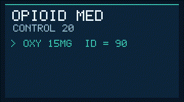

# Opioid MED (Morphine-Equivalent Dose) Checker Guide

*medagent-core — Safety Control #20*



## Overview

`OpioidMedChecker` converts active opioids to CDC-style daily morphine-equivalent
dose (MED / MME), sums contributions across the regimen, and elevates severity
when total MED reaches a configurable high-MED threshold (default **90.0**).

It complements duplicate-therapy opioid flags (intra-class redundancy without
dose) and the pipeline drug-check demos
([`assets/demo_drugcheck.svg`](../../assets/demo_drugcheck.svg),
[`assets/demo_pipeline.svg`](../../assets/demo_pipeline.svg)) by covering
*dose-cumulative* overdose risk that medication-class checks miss.

Findings are advisory `OpioidMedRisk` records — RESEARCH USE ONLY — and the
checker is standalone (not exported from `safety/__init__.py` or wired into the
orchestrator).

## Conversion panel (conservative)

| Agent | Factor | Dose unit |
|---|---|---|
| morphine | 1.0 | mg/day |
| hydrocodone | 1.0 | mg/day |
| oxycodone | 1.5 | mg/day |
| oxymorphone | 3.0 | mg/day |
| hydromorphone | 4.0 | mg/day |
| codeine | 0.15 | mg/day |
| tramadol | 0.1 | mg/day |
| tapentadol | 0.4 | mg/day |
| meperidine | 0.1 | mg/day |
| methadone | 4.0 (simplified) | mg/day |
| fentanyl (patch) | 2.4 | mcg/hr |

Matching is whole-token (same style as the allergy and duplicate-therapy
checkers). Daily dose is parsed from `name` / `dosage` / `frequency` (BID, TID,
QID, qNh, daily). Opioids without a parseable dose are skipped.

## Quick start

```python
from medagent.models import Medication
from medagent.safety.opioid_med_checker import OpioidMedChecker

findings = OpioidMedChecker().check(
    medications=[
        Medication(name="Oxycodone", dosage="15 mg", frequency="QID"),
        Medication(name="Hydrocodone 10 mg TID"),
    ],
    high_med_threshold=90.0,
)
for finding in findings:
    print(
        finding.agent,
        finding.med_contribution,
        finding.total_med,
        finding.severity,
        finding.rationale,
    )
```

## Reasoning stack notes

When this checker’s findings are summarized by an upstream reasoning / routing
layer, prefer current frontier models for clinical prose:

- **GPT-5.5**
- **Claude Sonnet 4.6**
- **Gemini 2.5**
- **Kimi K2**

The checker itself is deterministic and does not call an LLM.

## See also

- [SAFETY.md §3.20](../../SAFETY.md)
- [README safety controls table](../../README.md)
- [CHANGELOG](../../CHANGELOG.md)
- Drug-check demo: [`assets/demo_drugcheck.svg`](../../assets/demo_drugcheck.svg)
