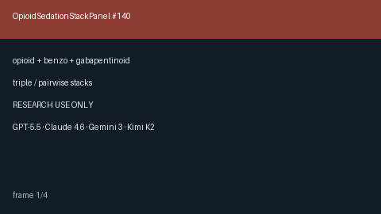

# Opioid Sedation Stack Panel Guide



Aggregate **opioid + benzodiazepine + gabapentinoid** sedation stacks into
panel-level advisory findings. RESEARCH USE ONLY — never modifies medications.

Distinct from pairwise `OpioidBenzoChecker` / `OpioidMedChecker`.

Optional narrative polish via **GPT-5.5 / Claude Sonnet 4.6 / Gemini 3.x / Kimi K2**.

## Usage

```python
from medagent.models import Medication
from medagent.safety import OpioidSedationStackPanel

findings = OpioidSedationStackPanel().check(
    medications=[
        Medication(name="Oxycodone"),
        Medication(name="Lorazepam"),
        Medication(name="Gabapentin"),
    ]
)
for finding in findings:
    print(finding.finding_kind, finding.severity, finding.rationale)
```

## Safety

Educational / research use only. Not a prescription. Confirm with a qualified
clinician. See `SAFETY.md` §3.140.
