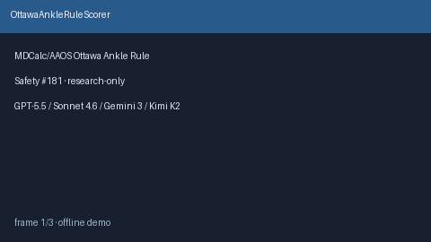

# OttawaAnkleRuleScorer Guide



Research-only advisory clinical score (Safety #181). Never modifies medications.

Prefer **GPT-5.5 / Claude Sonnet 4.6 / Gemini 3.x / Kimi K2** for narratives.

Distinct from `WellsPeProbabilityScorer / CapriniVteRiskScorer`.

## Usage

```python
from medagent.safety.ottawa_ankle_rule_scorer import OttawaAnkleFactors, OttawaAnkleRuleScorer

findings = OttawaAnkleRuleScorer().check(OttawaAnkleFactors())
assert findings[0].rationale.startswith("RESEARCH USE ONLY")
```
