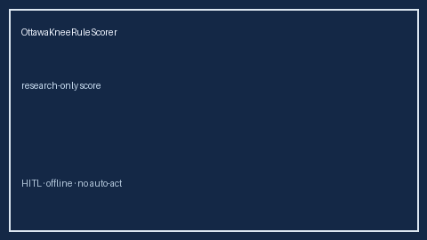

# OttawaKneeRuleScorer Guide



Research-only advisory scorer. Closes the MDCalc / ACEP / EHR Ottawa Knee Rule score gap.

Optional later polish via **GPT-5.5 / Claude Sonnet 4.6 / Gemini 3.x / Kimi K2**.

Distinct from `OttawaAnkleRuleScorer` / `CanadianCspineRuleScorer`.

## Usage

```python
from medagent.safety.ottawa_knee_rule_scorer import (
    OttawaKneeRuleScorer,
    OttawaKneeRuleFactors,
)

findings = OttawaKneeRuleScorer().check(OttawaKneeRuleFactors())
print(findings[0].band, findings[0].rationale)
```

## Safety

RESEARCH USE ONLY. Never modifies medications. No HTTP. See `SAFETY.md` #201.
