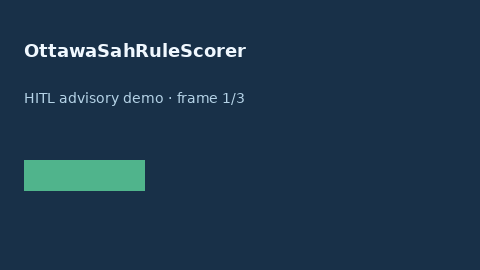

# OttawaSahRuleScorer Guide



Research-only advisory scorer (Safety #215). Never modifies medications.

Gap vs MDCalc / ACEP Ottawa SAH Rule. Distinct from `HuntHessSahScorer / WfnsSahScorer / FisherGradeScorer`.

Optional polish via **GPT-5.5 / Claude Sonnet 4.6 / Gemini 3.x / Kimi K2**.

## Usage

```python
from medagent.safety.ottawa_sah_rule_scorer import (
    OttawaSahRuleFactors,
    OttawaSahRuleScorer,
)

findings = OttawaSahRuleScorer().check(OttawaSahRuleFactors())
assert "RESEARCH USE ONLY" in findings[0].rationale
print(findings[0].band, findings[0].score)
```

## Safety

RESEARCH USE ONLY. See `SAFETY.md`.
