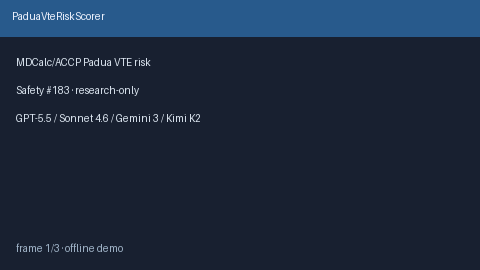

# PaduaVteRiskScorer Guide



Research-only advisory clinical score (Safety #183). Never modifies medications.

Prefer **GPT-5.5 / Claude Sonnet 4.6 / Gemini 3.x / Kimi K2** for narratives.

Distinct from `CapriniVteRiskScorer / WellsPeProbabilityScorer`.

## Usage

```python
from medagent.safety.padua_vte_risk_scorer import PaduaVteFactors, PaduaVteRiskScorer

findings = PaduaVteRiskScorer().check(PaduaVteFactors())
assert findings[0].rationale.startswith("RESEARCH USE ONLY")
```
