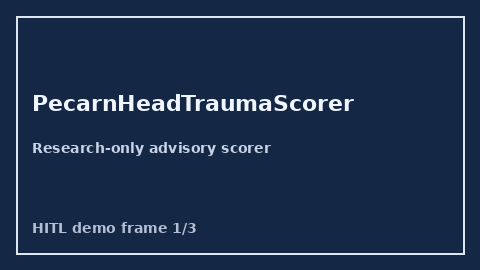

# PecarnHeadTraumaScorer Guide



Research-only advisory scorer. Closes the MDCalc / ACEP / EHR PECARN pediatric head trauma score gap.

Optional later polish via **GPT-5.5 / Claude Sonnet 4.6 / Gemini 3.x / Kimi K2**.

Distinct from `CanadianCspineRuleScorer` / `FallRiskChecker`.

## Usage

```python
from medagent.safety.pecarn_head_trauma_scorer import (
    PecarnHeadTraumaScorer,
    PecarnHeadTraumaFactors,
)

findings = PecarnHeadTraumaScorer().check(PecarnHeadTraumaFactors())
print(findings[0].band, findings[0].rationale)
```

## Safety

RESEARCH USE ONLY. Never modifies medications. No HTTP. See `SAFETY.md` #196.
