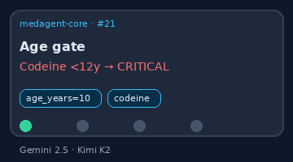

# Pediatric Dose Checker Guide

*medagent-core — Safety Control #21*



## Overview

`PediatricDoseChecker` flags paediatric **age contraindications** (for example
codeine / tramadol under 12 years, tetracyclines under 8 years) and optional
**mg/kg/day** ceiling excesses (acetaminophen, ibuprofen, amoxicillin) for a
patient's age and weight.

It complements Beers (older-adult PIMs), renal/hepatic dose checkers, and the
pipeline drug-check demos
([`assets/demo_drugcheck.svg`](../../assets/demo_drugcheck.svg),
[`assets/demo_pipeline.svg`](../../assets/demo_pipeline.svg)) by covering
*age- and weight-conditioned* paediatric risk that adult-oriented checkers miss.

Findings are advisory `PediatricDoseRisk` records — RESEARCH USE ONLY — and the
checker is standalone (not exported from `safety/__init__.py` or wired into the
orchestrator).

## Panel (conservative)

| Agent | Age gate | Max mg/kg/day | Severity |
|---|---|---|---|
| codeine | < 12 y | — | CRITICAL |
| tramadol | < 12 y | — | CRITICAL |
| tetracycline / doxycycline / minocycline | < 8 y | — | HIGH |
| aspirin | < 16 y | — | HIGH |
| acetaminophen / paracetamol | — | 75 | HIGH |
| ibuprofen | — | 40 | MODERATE |
| amoxicillin | — | 90 | MODERATE |

Matching is whole-token (same style as the allergy and duplicate-therapy
checkers). Daily mg dose is parsed from `name` / `dosage` / `frequency` when a
weight-based rule applies.

## Quick start

```python
from medagent.models import Medication
from medagent.safety.pediatric_dose_checker import PediatricDoseChecker

findings = PediatricDoseChecker().check(
    medications=[
        Medication(name="Codeine 15 mg"),
        Medication(name="Acetaminophen", dosage="500 mg", frequency="QID"),
    ],
    age_years=7,
    weight_kg=20.0,
)
for finding in findings:
    print(
        finding.agent,
        finding.finding_kind,
        finding.dose_mg_per_kg_day,
        finding.severity,
        finding.rationale,
    )
```

## Reasoning stack notes

When this checker’s findings are summarized by an upstream reasoning / routing
layer, prefer current frontier models for clinical prose:

- **GPT-5.5**
- **Claude Sonnet 4.6**
- **Gemini 2.5**
- **Kimi K2**

The checker itself is deterministic and does not call an LLM.

## See also

- [SAFETY.md §3.21](../../SAFETY.md)
- [README safety controls table](../../README.md)
- [CHANGELOG](../../CHANGELOG.md)
- Drug-check demo: [`assets/demo_drugcheck.svg`](../../assets/demo_drugcheck.svg)
