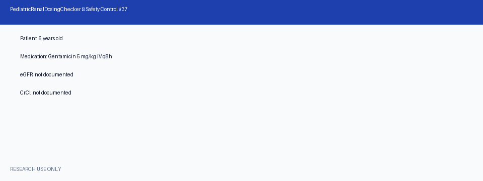

# Pediatric Renal Dosing Checker Guide

*medagent-core — Safety Control #37*



## Overview

`PediatricRenalDosingChecker` flags **renally-cleared medications in pediatric
patients** when **eGFR and CrCl are both missing** or when the available renal
function value is **below an age-adjusted threshold**. It complements
`RenalDoseChecker` (adult eGFR-conditioned dosing) and `PediatricDoseChecker`
(age/weight contraindications) by focusing on the pediatric dosing gap when
renal function data is absent or subnormal.

Findings are advisory `PediatricRenalRisk` records — **RESEARCH USE ONLY** —
and the checker is exported from `medagent.safety`.

## Age-adjusted thresholds

| Age band | Minimum acceptable eGFR/CrCl |
|---|---|
| &lt; 2 years | ≥ **90** mL/min/1.73m² (or mL/min for CrCl) |
| 2–11 years | ≥ **75** |
| 12–17 years | ≥ **60** |

The effective threshold is the **higher** of the age-band floor and the
agent-specific threshold.

## Curated renal panel (pediatric)

| Category | Agents | Typical severity |
|---|---|---|
| Aminoglycosides | gentamicin, tobramycin, amikacin | HIGH |
| Glycopeptides | vancomycin (alias: vancocin) | HIGH |
| Antivirals | acyclovir, ganciclovir | HIGH |
| Anticoagulants | enoxaparin | HIGH |
| Other renally-cleared | metformin, nitrofurantoin, gabapentin, pregabalin, cefepime, ceftazidime, cephalexin (alias: keflex), amoxicillin | MODERATE–HIGH |

Medication matching is whole-token based: `Pseudovancomycin` does not match
`vancomycin`. Markedly low renal function (&lt;50% of threshold) elevates
severity to `CRITICAL`.

## Quick start

```python
from medagent.models import Medication
from medagent.safety import PediatricRenalDosingChecker

findings = PediatricRenalDosingChecker().check(
    medications=[
        Medication(name="Gentamicin 5 mg/kg IV q8h"),
        Medication(name="Acetaminophen 160 mg"),
    ],
    age_years=6.0,
    egfr=None,
    crcl=None,
)
for finding in findings:
    print(
        finding.agent,
        finding.finding_kind,
        finding.severity,
        finding.age_adjusted_threshold,
        finding.rationale,
    )
```

## Reasoning stack notes

When this checker's findings are summarized by an upstream reasoning / routing
layer, prefer current frontier models for clinical prose:

- **GPT-5.5**
- **Claude Sonnet 4.6**
- **Gemini 3.x**
- **Kimi K2**

The checker itself is deterministic and does not call an LLM.

## See also

- [SAFETY.md §3.37](../../SAFETY.md)
- [README safety controls table](../../README.md)
- Renal dose (adult): `safety/renal_dose_checker.py`
- Pediatric dose / age: `safety/pediatric_dose_checker.py`
