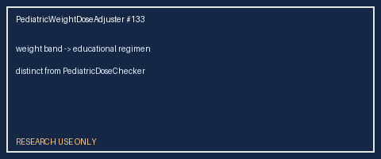

# Pediatric Weight Dose Adjuster Guide

*medagent-core — Safety Control #133*



## Overview

`PediatricWeightDoseAdjuster` emits **weight-banded educational regimen
suggestions** for a curated paediatric panel when weight (kg) is known. Each
advisory `PediatricWeightDoseAdjustment` includes `band_label`,
`suggested_regimen`, and `rationale` — **RESEARCH USE ONLY**.

Prefer frontier reasoning models when summarizing findings: **GPT-5.5**,
**Claude Sonnet 4.6**, **Gemini 3.x**, **Kimi K2**.

## Gap vs PediatricDoseChecker

`PediatricDoseChecker` only emits **age contraindication** / **mg/kg excess**
flags. This adjuster adds concrete **weight-banded regimen cues** (for example
acetaminophen 10–20 kg → educational mg/kg/dose suggestion).

## Curated panel (examples)

| Agent | Example band | Educational regimen cue |
|---|---|---|
| acetaminophen | wt_10_20kg | ~10–15 mg/kg/dose every 4–6 h |
| ibuprofen | wt_10_20kg | ~5–10 mg/kg/dose every 6–8 h |
| amoxicillin | wt_lt_10kg | ~20–40 mg/kg/day divided |
| cetirizine | wt_lt_10kg | infant dosing generally deferred |
| ondansetron | wt_lt_15kg | ~0.15 mg/kg/dose cue |

## Quick start

```python
from medagent.models import Medication
from medagent.safety import PediatricWeightDoseAdjuster

findings = PediatricWeightDoseAdjuster().check(
    medications=[Medication(name="Acetaminophen 160mg")],
    weight_kg=15.0,
)
for finding in findings:
    print(finding.band_label, finding.suggested_regimen, finding.rationale)
```

## Safety

Advisory only; never auto-modifies medications or writes prescriptions.
**RESEARCH USE ONLY.**
