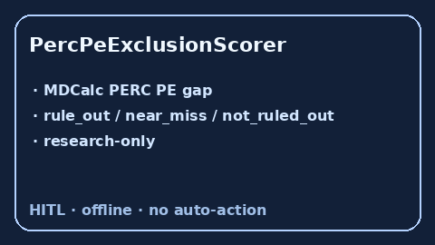

# PercPeExclusionScorer Guide



Research-only PERC PE exclusion score. Never modifies medications.

Optional polish via **GPT-5.5 / Claude Sonnet 4.6 / Gemini 3.x / Kimi K2**.

Distinct from `WellsPeProbabilityScorer` and `PaduaVteRiskScorer`.

## Usage

```python
from medagent.safety.perc_pe_exclusion_scorer import PercPeFactors, PercPeExclusionScorer

findings = PercPeExclusionScorer().check(PercPeFactors())
assert findings[0].rationale.startswith("RESEARCH USE ONLY")
print(findings[0].band, findings[0].score)
```
