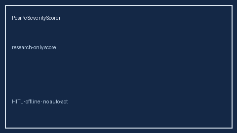

# PesiPeSeverityScorer Guide



Research-only advisory scorer. Closes the MDCalc / ESC / EHR PESI PE severity score gap.

Optional later polish via **GPT-5.5 / Claude Sonnet 4.6 / Gemini 3.x / Kimi K2**.

Distinct from `WellsPeProbabilityScorer` / `RevisedGenevaPeScorer`.

## Usage

```python
from medagent.safety.pesi_pe_severity_scorer import (
    PesiPeSeverityScorer,
    PesiPeSeverityFactors,
)

findings = PesiPeSeverityScorer().check(PesiPeSeverityFactors())
print(findings[0].band, findings[0].rationale)
```

## Safety

RESEARCH USE ONLY. Never modifies medications. No HTTP. See `SAFETY.md` #199.
