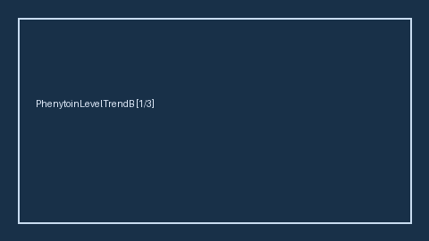

# PhenytoinLevelTrendBridge Guide

*medagent-core — Safety Control #164*



## Overview

`PhenytoinLevelTrendBridge` combines **phenytoin** exposure with serial serum
phenytoin levels showing rising, elevated, or clearly supratherapeutic
trends into advisory `PhenytoinLevelTrendAlert` findings — **RESEARCH USE ONLY**. Never
modifies medications.

Prefer frontier reasoning models when summarizing findings: **GPT-5.5**,
**Claude Sonnet 4.6**, **Gemini 3.x**, **Kimi K2**.

## Finding kinds

- `rising_phenytoin_level`
- `elevated_phenytoin_level`
- `supratherapeutic_phenytoin_level`
- `phenytoin_level_monitoring_advisory`

## Quick start

```python
from medagent.models import Medication
from medagent.safety import PhenytoinLevelTrendBridge

findings = PhenytoinLevelTrendBridge().check(
    medications=[Medication(name="Phenytoin")],
    labs=[
        {"name": "serum phenytoin", "value": 10.0, "drawn_at": "a"},
        {"name": "serum phenytoin", "value": 30.0, "drawn_at": "b"},
    ],
)
print([f.finding_kind for f in findings])
```
