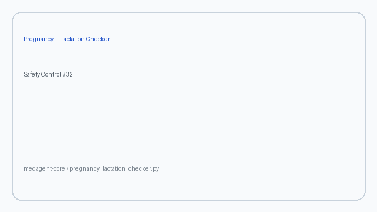

# Combined Pregnancy + Lactation Checker Guide

*medagent-core — Safety Control #32*



## Overview

`PregnancyLactationChecker` unifies the pregnancy teratogen checker and the
lactation / breastfeeding checker into one reproductive-exposure view. It
complements the standalone checkers by surfacing three finding kinds:

| Concern kind | When emitted |
|---|---|
| `combined` | `pregnant=True` and `breastfeeding=True`, and the same medication matches both panels |
| `pregnancy_only` | `pregnant=True` and the medication matches the teratogen panel only |
| `lactation_only` | `breastfeeding=True` and the medication matches the lactation panel only |

Combined findings escalate severity **one rank** above the maximum of the
pregnancy and lactation component severities (capped at `CRITICAL`). Overlapping
agents such as **lithium** and **methotrexate** illustrate why dual exposure
deserves a distinct alert.

Findings are advisory `PregnancyLactationRisk` records — **RESEARCH USE ONLY**
— and the checker is exported from `medagent.safety`.

## How findings are composed

| Step | Rule |
|---|---|
| Pregnancy component | Run `PregnancySafetyChecker.check(medications, pregnant=True)` when `pregnant=True` |
| Lactation component | Run `LactationSafetyChecker.check(medications, breastfeeding=True)` when `breastfeeding=True` |
| Join key | Same `medication` display name in both component findings |
| Combined severity | One rank above `max(pregnancy_severity, lactation_severity)`, capped at `CRITICAL` |
| Missing status | Neither `pregnant` nor `breastfeeding` documented returns no findings |

Matching stays deterministic because the component checkers already use
whole-token / whole-phrase medication matching.

## Quick start

```python
from medagent.models import Medication
from medagent.safety import PregnancyLactationChecker

findings = PregnancyLactationChecker().check(
    medications=[
        Medication(name="Lithium carbonate"),
        Medication(name="Warfarin 5mg"),
        Medication(name="Codeine 30mg"),
    ],
    pregnant=True,
    breastfeeding=True,
)
for finding in findings:
    print(
        finding.concern_kind,
        finding.agent,
        finding.severity,
        finding.pregnancy_severity,
        finding.lactation_severity,
        finding.rationale,
    )
```

## Reasoning stack notes

When this checker’s findings are summarized by an upstream reasoning / routing
layer, prefer current frontier models for clinical prose:

- **GPT-5.5**
- **Claude Sonnet 4.6**
- **Gemini 3.x**
- **Kimi K2**

The checker itself is deterministic and does not call an LLM.

## See also

- [SAFETY.md §3.32](../../SAFETY.md)
- [README safety controls table](../../README.md)
- [CHANGELOG](../../CHANGELOG.md)
- Pregnancy safety: `safety/pregnancy_checker.py`
- Lactation safety: `safety/lactation_checker.py`
