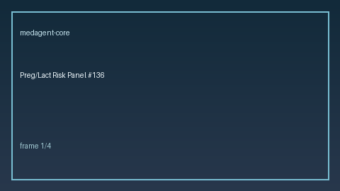

# Pregnancy/Lactation Risk Panel Guide

*medagent-core - Safety Control #136*



## Overview

`PregnancyLactationRiskPanel` aggregates **pregnancy vs lactation hit counts**,
dual hits, and optional trimester context across a medication list into
panel-level `PregnancyLactationPanelRisk` findings - **RESEARCH USE ONLY**.

Prefer frontier reasoning models when summarizing findings: **GPT-5.5**,
**Claude Sonnet 4.6**, **Gemini 3.x**, **Kimi K2**.

## Gap vs existing checker

| Control | What it emits |
|---|---|
| `PregnancyLactationChecker` | Per-medication pregnancy / lactation / combined findings |
| **`PregnancyLactationRiskPanel`** | Aggregate panel: hit counts, dual hits, trimester context |

## Finding kinds

- `panel_summary` - overall pregnancy / lactation / dual-hit counts
- `pregnancy_aggregate` - 2+ distinct pregnancy-panel agents
- `lactation_aggregate` - 2+ distinct lactation-panel agents
- `dual_hit_aggregate` - agents on both pregnancy and lactation panels
- `trimester_context` - trimester 2/3 with ACE/ARB/tetracycline agents

## Quick start

```python
from medagent.models import Medication
from medagent.safety import PregnancyLactationRiskPanel

findings = PregnancyLactationRiskPanel().check(
    medications=[
        Medication(name="Methotrexate"),
        Medication(name="Warfarin"),
    ],
    pregnant=True,
    breastfeeding=True,
    trimester="2",
)
for finding in findings:
    print(finding.finding_kind, finding.dual_hit_count, finding.rationale)
```

## Safety

Advisory only; never auto-modifies medications.
**RESEARCH USE ONLY.**
