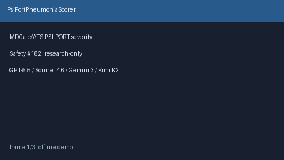

# PsiPortPneumoniaScorer Guide



Research-only advisory clinical score (Safety #182). Never modifies medications.

Prefer **GPT-5.5 / Claude Sonnet 4.6 / Gemini 3.x / Kimi K2** for narratives.

Distinct from `Curb65PneumoniaScorer / SofaOrganFailureScorer`.

## Usage

```python
from medagent.safety.psi_port_pneumonia_scorer import PsiPortFactors, PsiPortPneumoniaScorer

findings = PsiPortPneumoniaScorer().check(PsiPortFactors())
assert findings[0].rationale.startswith("RESEARCH USE ONLY")
```
