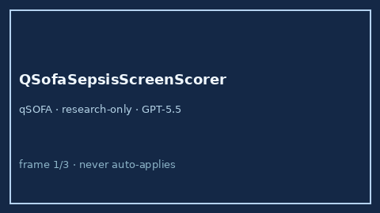

# QSofaSepsisScreenScorer Guide



Research-only advisory clinical score (Safety #178). Never modifies medications.

Prefer **GPT-5.5 / Claude Sonnet 4.6 / Gemini 3.x / Kimi K2** for narratives.

Distinct from `SofaOrganFailureScorer / VitalsTriageChecker`.

## Usage

```python
from medagent.safety.qsofa_sepsis_screen_scorer import (
    QSofaSepsisScreenFactors,
    QSofaSepsisScreenScorer,
)

findings = QSofaSepsisScreenScorer().check(QSofaSepsisScreenFactors())
assert findings[0].rationale.startswith("RESEARCH USE ONLY")
```
