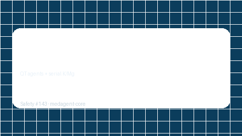

# QTc Electrolyte Bridge Guide



Combine **QT-prolonging agents** with serial **potassium / magnesium** draws into
advisory electrolyte–QT risk cues. RESEARCH USE ONLY — never modifies medications.

Distinct from `ElectrolyteQtChecker` (point-in-time K/Mg), `QtProlongationPanel`
(multi-drug QT aggregate), and `LabTrendAlertBridge` (generic serial labs without
QT-agent context).

Optional narrative polish via **GPT-5.5 / Claude Sonnet 4.6 / Gemini 3.x / Kimi K2**.

## Usage

```python
from medagent.models import Medication
from medagent.safety import QTcElectrolyteBridge

findings = QTcElectrolyteBridge().check(
    medications=[Medication(name="Azithromycin")],
    labs=[
        {"name": "potassium", "value": 4.2, "unit": "mmol/L", "drawn_at": "t1"},
        {"name": "potassium", "value": 3.1, "unit": "mmol/L", "drawn_at": "t2"},
    ],
)
for finding in findings:
    print(finding.finding_kind, finding.severity, finding.rationale)
```

## Finding kinds

- `falling_k_on_qt_agent` — falling potassium series on a QT agent
- `falling_mg_on_qt_agent` — falling magnesium series on a QT agent
- `low_k_on_qt_agent` — latest K below 3.5 mmol/L on a QT agent
- `low_mg_on_qt_agent` — latest Mg below 1.7 mg/dL on a QT agent
- `multi_qt_agent_electrolyte_risk` — ≥2 QT agents plus any adverse K/Mg cue

## Safety

Educational / research use only. Not a prescription. See `SAFETY.md` §3.143.
