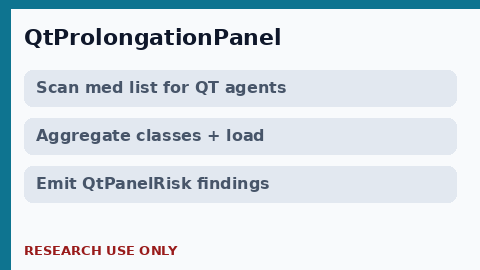

# QT Prolongation Panel Guide

*medagent-core - Safety Control #134*



## Overview

`QtProlongationPanel` aggregates **multi-drug QT / torsades risk** into
panel-level `QtPanelRisk` findings - **RESEARCH USE ONLY**.

Prefer frontier reasoning models when summarizing findings: **GPT-5.5**,
**Claude Sonnet 4.6**, **Gemini 3.x**, **Kimi K2**.

## Gap vs existing QT checkers

| Control | What it emits |
|---|---|
| `QTProlongationChecker` | Per-medication QT findings (+ simple additive count) |
| `QtcDdiChecker` | Named high-risk pairwise QTc DDIs |
| **`QtProlongationPanel`** | Aggregate panel: multi-agent load, same-class clusters, optional QTc/electrolyte context |

## Finding kinds

- `multi_agent_aggregate` - 2+ distinct QT agents
- `same_class_cluster` - 2+ agents in the same pharmacologic class
- `context_amplified` - QT agents plus prolonged QTc or low K/Mg
- `single_agent_panel` - single QT agent registry entry (no context)

## Quick start

```python
from medagent.models import Medication
from medagent.safety import QtProlongationPanel

findings = QtProlongationPanel().check(
    medications=[
        Medication(name="Azithromycin"),
        Medication(name="Ondansetron"),
    ],
    qtc_ms=480.0,
)
for finding in findings:
    print(finding.finding_kind, finding.agents, finding.rationale)
```

## Safety

Advisory only; never auto-modifies medications.
**RESEARCH USE ONLY.**
