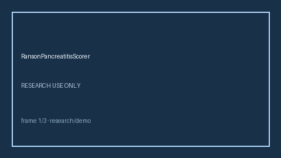

# RansonPancreatitisScorer Guide



Research-only advisory scorer. Closes the MDCalc / ACG / EHR Ranson pancreatitis criteria gap.

Optional later polish via **GPT-5.5 / Claude Sonnet 4.6 / Gemini 3.x / Kimi K2**.

Distinct from `AlvaradoAppendicitisScorer / SofaOrganFailureScorer`.

## Usage

```python
from medagent.safety.ranson_pancreatitis_scorer import (
    RansonPancreatitisScorer,
    RansonPancreatitisFactors,
)

findings = RansonPancreatitisScorer().check(RansonPancreatitisFactors())
print(findings[0].band, findings[0].rationale)
```

## Safety

RESEARCH USE ONLY. Never modifies medications. No HTTP. See `SAFETY.md` #193.
