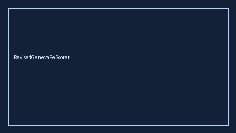

# RevisedGenevaPeScorer Guide



Research-only advisory scorer. Closes the MDCalc / ESC / EHR Revised Geneva PE gap.

Optional later polish via **GPT-5.5 / Claude Sonnet 4.6 / Gemini 3.x / Kimi K2**.

Distinct from `WellsPeProbabilityScorer / PercPeExclusionScorer`.

## Usage

```python
from medagent.safety.revised_geneva_pe_scorer import (
    RevisedGenevaPeScorer,
    RevisedGenevaPeFactors,
)

findings = RevisedGenevaPeScorer().check(RevisedGenevaPeFactors())
print(findings[0].band, findings[0].rationale)
```

## Safety

RESEARCH USE ONLY. Never modifies medications. No HTTP. See `SAFETY.md` #192.
