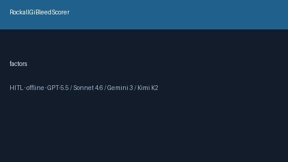

# RockallGiBleedScorer Guide



Research-only advisory scorer (Safety #203). Never modifies medications.

Gap vs MDCalc / BSG / EHR Rockall upper-GI bleed score. Distinct from `GlasgowBlatchfordScorer / Curb65PneumoniaScorer`.

Optional polish via **GPT-5.5 / Claude Sonnet 4.6 / Gemini 3.x / Kimi K2**.

## Usage

```python
from medagent.safety.rockall_gi_bleed_scorer import RockallGiBleedFactors, RockallGiBleedScorer

findings = RockallGiBleedScorer().check(RockallGiBleedFactors())
assert "RESEARCH USE ONLY" in findings[0].rationale
print(findings[0].band, findings[0].score)
```

## Safety

RESEARCH USE ONLY. See `SAFETY.md`.
