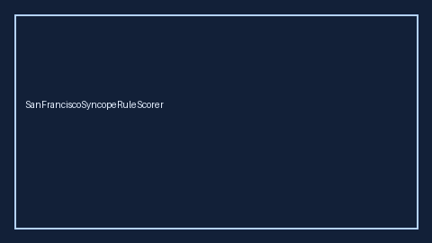

# SanFranciscoSyncopeRuleScorer Guide



Research-only advisory scorer. Closes the MDCalc / ACEP / EHR San Francisco Syncope Rule gap.

Optional later polish via **GPT-5.5 / Claude Sonnet 4.6 / Gemini 3.x / Kimi K2**.

Distinct from `NihssStrokeScorer / FallRiskChecker`.

## Usage

```python
from medagent.safety.san_francisco_syncope_rule_scorer import (
    SanFranciscoSyncopeRuleScorer,
    SanFranciscoSyncopeFactors,
)

findings = SanFranciscoSyncopeRuleScorer().check(SanFranciscoSyncopeFactors())
print(findings[0].band, findings[0].rationale)
```

## Safety

RESEARCH USE ONLY. Never modifies medications. No HTTP. See `SAFETY.md` #190.
