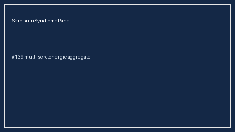

# Serotonin Syndrome Panel Guide

*medagent-core - Safety Control #139*



## Overview

`SerotoninSyndromePanel` aggregates **multi-serotonergic agents**
(SSRI/SNRI/MAOI/triptan/tramadol/etc.) into panel-level
`SerotoninSyndromePanelRisk` findings - **RESEARCH USE ONLY**.

Prefer frontier reasoning models when summarizing findings: **GPT-5.5**,
**Claude Sonnet 4.6**, **Gemini 3.x**, **Kimi K2**.

## Gap vs existing checkers

| Control | What it emits |
|---|---|
| `SerotoninSyndromeChecker` | Per-medication findings when ≥2 serotonergic agents |
| `MethyleneBlueSsriChecker` | Pairwise methylene blue + SSRI/SNRI |
| **`SerotoninSyndromePanel`** | Aggregate multi-class serotonergic stacks |

## Finding kinds

- `multi_serotonergic_stack` - ≥2 serotonergic agents
- `maoi_serotonergic_stack` - MAOI (incl. methylene blue / linezolid) + other
- `multi_class_serotonergic_stack` - ≥3 pharmacologic classes
- `ssri_snri_triptan_stack` - SSRI/SNRI + triptan
- `ssri_snri_serotonergic_opioid_stack` - SSRI/SNRI + tramadol/etc.

## Quick start

```python
from medagent.models import Medication
from medagent.safety import SerotoninSyndromePanel

findings = SerotoninSyndromePanel().check(
    medications=[
        Medication(name="Sertraline"),
        Medication(name="Tramadol"),
        Medication(name="Sumatriptan"),
    ],
)
for finding in findings:
    print(finding.finding_kind, finding.stack_size, finding.rationale)
```

## Safety

Advisory only; never auto-modifies medications.
**RESEARCH USE ONLY.**
