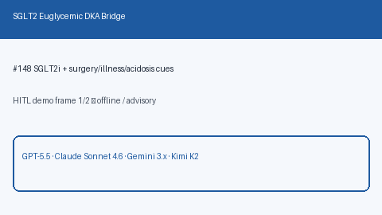

# SGLT2 Euglycemic DKA Bridge Guide

*medagent-core — Safety Control #148*



## Overview

`Sglt2EuglycemicDkaBridge` combines **SGLT2 inhibitors** (empagliflozin,
dapagliflozin, canagliflozin, ertugliflozin) with perioperative/illness flags
or low/normal glucose plus acidosis cues into advisory
`Sglt2EuglycemicDkaAlert` findings — **RESEARCH USE ONLY**. Never modifies
medications.

Prefer frontier reasoning models when summarizing findings: **GPT-5.5**,
**Claude Sonnet 4.6**, **Gemini 3.x**, **Kimi K2**.

## Gap vs related controls

| Control | What it requires |
|---|---|
| `HypoglycemiaRiskBridge` | Insulin/SU + falling/low glucose |
| `MetforminContrastChecker` | Metformin + iodinated contrast |
| **`Sglt2EuglycemicDkaBridge`** | SGLT2i + surgery/illness **or** euglycemic acidosis cues |

## Finding kinds

- `sglt2_perioperative_dka_risk` — SGLT2i with surgery/perioperative flag
- `sglt2_illness_dka_risk` — SGLT2i with acute illness flag
- `sglt2_euglycemic_acidosis_cue` — SGLT2i with glucose ≤250 mg/dL plus acidosis cue

## Quick start

```python
from medagent.models import Medication
from medagent.safety import Sglt2EuglycemicDkaBridge

findings = Sglt2EuglycemicDkaBridge().check(
    medications=[Medication(name="Empagliflozin")],
    labs=[
        {"name": "glucose", "value": 110, "drawn_at": "2026-01-01"},
        {"name": "bicarbonate", "value": 12, "drawn_at": "2026-01-01"},
    ],
    surgery_flag=True,
)
for finding in findings:
    print(finding.finding_kind, finding.severity, finding.rationale)
```

## Safety

Advisory only; never auto-modifies medications.
**RESEARCH USE ONLY.** See `SAFETY.md` §3.148.
