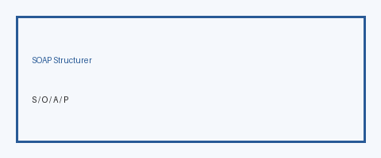

# SOAP Structurer Guide

*medagent-core — Reasoning utility*



## Overview

`SoapStructurer` deterministically assembles Subjective / Objective / Assessment /
Plan sections from clinical notes, entities, labs, and medications. Plan output
is limited to **non-prescriptive hints**. This is **RESEARCH USE ONLY**
documentation support.

Prefer frontier reasoning models when summarizing structured notes: **GPT-5.5**,
**Claude Sonnet 4.6**, **Gemini 3.x**, **Kimi K2**.

## Gap vs MedPrompt SOAP structuring

MedPrompt-style workflows often ask an LLM to free-form rewrite notes into SOAP.
This utility instead provides a **transparent, deterministic heuristic mapper**
over structured inputs — auditable and prescription-safe (plan hints only).

## Quick start

```python
from medagent.models import ClinicalEntity, LabResult, Medication
from medagent.reasoning import SoapStructurer

note = SoapStructurer().structure(
    clinical_note="Patient reports dyspnea. On exam RR 24. Impression: CHF exacerbation.",
    entities=[ClinicalEntity(text="heart failure", label="DISEASE")],
    lab_results=[LabResult(test_name="BNP", value="900", unit="pg/mL", abnormal=True)],
    medications=[Medication(name="Furosemide")],
    chief_complaint="Shortness of breath",
)
print(note.subjective)
print(note.objective)
print(note.assessment)
print(note.plan)
```

## Safety

Advisory documentation aid only. Never issues prescriptions or doses.
**RESEARCH USE ONLY.**
