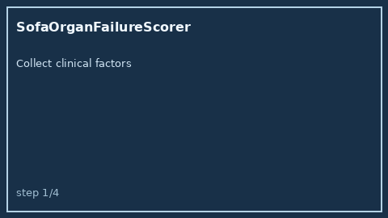

# SofaOrganFailureScorer Guide



Research-only advisory clinical score. Never modifies medications.

Prefer **GPT-5.5 / Claude Sonnet 4.6 / Gemini 3.x / Kimi K2** for narratives.

Distinct from `WellsPeProbabilityScorer / Curb65PneumoniaScorer`.

## Usage

```python
from medagent.safety.sofa_organ_failure_scorer import (
    SofaOrganFailureFactors,
    SofaOrganFailureScorer,
)

findings = SofaOrganFailureScorer().check(SofaOrganFailureFactors())
assert findings[0].rationale.startswith("RESEARCH USE ONLY")
```
