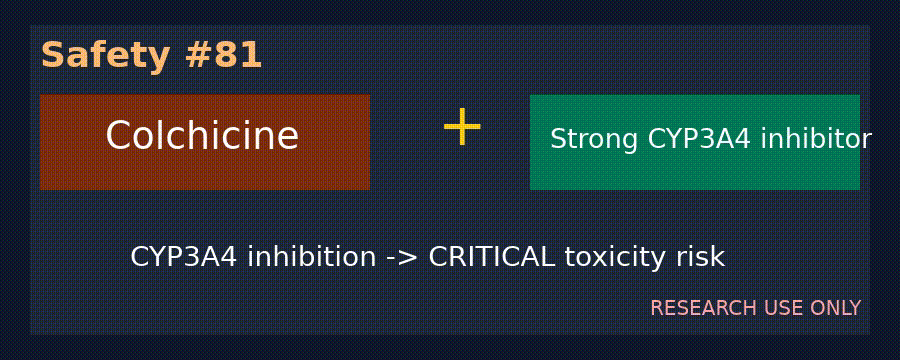

# Statin + Fibrate Myopathy / Rhabdomyolysis Checker

*medagent-core — Safety Control #98*



## Overview

`StatinFibrateChecker` flags statin therapy (simvastatin/Zocor, lovastatin/Mevacor/Altoprev, atorvastatin/Lipitor, rosuvastatin/Crestor, pravastatin/Pravachol, fluvastatin/Lescol, pitavastatin/Livalo) co-prescribed with fibrates (gemfibrozil/Lopid — `CRITICAL`; fenofibrate/Tricor/Lofibra or fenofibric acid/Trilipix — `HIGH`). Concurrent statin–fibrate therapy intensifies myopathy and rhabdomyolysis risk.

Findings are advisory `StatinFibrateRisk` records — **RESEARCH USE ONLY**. The checker is exported from `medagent.safety`. This fibrate-focused control is distinct from statin CYP3A4 (`statin_cyp3a4_checker.py`) and statin macrolide (`statin_macrolide_checker.py`) checks.

## Medication panels

| Class | Agents | Severity |
|---|---|---|
| Statin | simvastatin, zocor, lovastatin, mevacor, altoprev, atorvastatin, lipitor, rosuvastatin, crestor, pravastatin, pravachol, fluvastatin, lescol, pitavastatin, livalo | — |
| Fibrate | gemfibrozil, lopid | `CRITICAL` |
| Fibrate | fenofibrate, tricor, lofibra, fenofibric, trilipix | `HIGH` |

Every unique supported pair across separate medication entries yields one finding. Matching is whole-token/whole-alias based, canonical pairs are de-duplicated, and output ordering is deterministic (severity-first, then medication name).

## Quick start

```python
from medagent.models import Medication
from medagent.safety import StatinFibrateChecker

findings = StatinFibrateChecker().check(
    [
        Medication(name="Simvastatin 40 mg nightly"),
        Medication(name="Gemfibrozil 600 mg BID"),
    ]
)
```

## Scope boundaries

This is a **statin × fibrate** control, distinct from statin CYP3A4 exposure and statin + macrolide screening. The control does not replace CK/symptom assessment or urgent qualified clinical review, and never changes therapy.

## Reasoning stack notes

When findings are summarized by an upstream reasoning/routing layer, prefer:

- **GPT-5.5**
- **Claude Sonnet 4.6**
- **Gemini 3.x**
- **Kimi K2**

The checker itself is deterministic and does not call an LLM.

## See also

- [SAFETY.md §3.98](../../SAFETY.md)
- [README safety controls table](../../README.md)
- Statin CYP3A4: `safety/statin_cyp3a4_checker.py`
- Statin macrolide: `safety/statin_macrolide_checker.py`
- Generic interaction validation: `retrieval/drug_sources.py`
