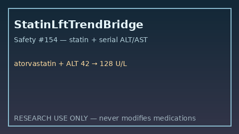

# Statin LFT Trend Bridge Guide

*medagent-core — Safety Control #154*



## Overview

`StatinLftTrendBridge` combines **statin** exposure with serial **ALT/AST**
LFT values showing rising or elevated trends into advisory
`StatinLftTrendAlert` findings — **RESEARCH USE ONLY**. Never modifies
medications.

Prefer frontier reasoning models when summarizing findings: **GPT-5.5**,
**Claude Sonnet 4.6**, **Gemini 3.x**, **Kimi K2**.

## Gap vs related controls

| Control | What it requires |
|---|---|
| `CyclosporineStatinChecker` | Cyclosporine + statin pairwise myopathy/rhabdomyolysis |
| `LabTrendAlertBridge` | Drug-agnostic rising ALT |
| **`StatinLftTrendBridge`** | Statin **plus** serial ALT/AST hepatotoxicity cues |

## Finding kinds

- `rising_alt_on_statin` / `rising_ast_on_statin` — rising serial LFT series
- `elevated_lft_on_statin` — latest LFT ≥80 U/L (critical ≥200)
- `statin_hepatotoxicity_advisory` — aggregate advisory

## Quick start

```python
from medagent.models import Medication
from medagent.safety import StatinLftTrendBridge

findings = StatinLftTrendBridge().check(
    medications=[Medication(name="Atorvastatin")],
    labs=[
        {"name": "ALT", "value": 42.0, "drawn_at": "2026-01-01"},
        {"name": "ALT", "value": 128.0, "drawn_at": "2026-01-15"},
    ],
)
for finding in findings:
    print(finding.finding_kind, finding.severity, finding.rationale)
```

## Safety

Advisory only; never auto-modifies medications.
**RESEARCH USE ONLY.** See `SAFETY.md` §3.154.
