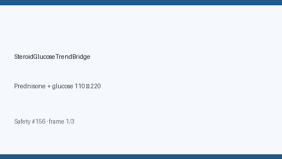

# Steroid Glucose Trend Bridge Guide

*medagent-core — Safety Control #156*



## Overview

`SteroidGlucoseTrendBridge` combines **systemic corticosteroid** exposure with
serial **glucose** values showing rising or elevated trends into advisory
`SteroidGlucoseTrendAlert` findings — **RESEARCH USE ONLY**. Never modifies
medications.

Prefer frontier reasoning models when summarizing findings: **GPT-5.5**,
**Claude Sonnet 4.6**, **Gemini 3.x**, **Kimi K2**.

## Gap vs related controls

| Control | What it requires |
|---|---|
| `CorticosteroidNsaidGiBleedPanel` | Corticosteroid + NSAID GI-bleed stack |
| `Sglt2EuglycemicDkaBridge` | SGLT2i + low/normal glucose + acidosis cues |
| **`SteroidGlucoseTrendBridge`** | Corticosteroid **plus** serial glucose rise/elevation |

## Finding kinds

- `rising_glucose_on_steroid` — rising serial glucose on corticosteroid
- `elevated_glucose_on_steroid` — latest glucose ≥180 mg/dL (critical ≥300)
- `steroid_hyperglycemia_advisory` — aggregate advisory

## Quick start

```python
from medagent.models import Medication
from medagent.safety import SteroidGlucoseTrendBridge

findings = SteroidGlucoseTrendBridge().check(
    medications=[Medication(name="Prednisone")],
    labs=[
        {"name": "glucose", "value": 110.0, "drawn_at": "2026-01-01"},
        {"name": "glucose", "value": 220.0, "drawn_at": "2026-01-08"},
    ],
)
for finding in findings:
    print(finding.finding_kind, finding.severity, finding.rationale)
```

## Safety

Advisory only; never auto-modifies medications.
**RESEARCH USE ONLY.** See `SAFETY.md` §3.156.
