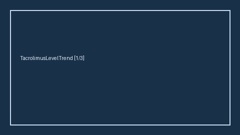

# TacrolimusLevelTrendBridge Guide

*medagent-core — Safety Control #163*



## Overview

`TacrolimusLevelTrendBridge` combines **tacrolimus** exposure with serial serum
tacrolimus levels showing rising, elevated, or clearly supratherapeutic
trends into advisory `TacrolimusLevelTrendAlert` findings — **RESEARCH USE ONLY**. Never
modifies medications.

Prefer frontier reasoning models when summarizing findings: **GPT-5.5**,
**Claude Sonnet 4.6**, **Gemini 3.x**, **Kimi K2**.

## Finding kinds

- `rising_tacrolimus_level`
- `elevated_tacrolimus_level`
- `supratherapeutic_tacrolimus_level`
- `tacrolimus_level_monitoring_advisory`

## Quick start

```python
from medagent.models import Medication
from medagent.safety import TacrolimusLevelTrendBridge

findings = TacrolimusLevelTrendBridge().check(
    medications=[Medication(name="Tacrolimus")],
    labs=[
        {"name": "serum tacrolimus", "value": 7.5, "drawn_at": "a"},
        {"name": "serum tacrolimus", "value": 20.0, "drawn_at": "b"},
    ],
)
print([f.finding_kind for f in findings])
```
