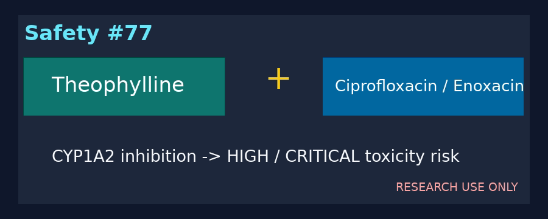

# Theophylline + CYP1A2-Inhibiting Quinolone Checker Guide

*medagent-core — Safety Control #77*



## Overview

`TheophyllineCiproChecker` flags theophylline-class therapy co-prescribed with
ciprofloxacin/Cipro or enoxacin. These quinolones inhibit CYP1A2-mediated
theophylline metabolism and can increase serum concentrations and toxicity.

Findings are advisory `TheophyllineCiproRisk` records — **RESEARCH USE ONLY** —
with **HIGH** severity for ciprofloxacin/Cipro and **CRITICAL** severity for the
more potent CYP1A2 inhibitor enoxacin. The checker is exported from
`medagent.safety`.

## Medication panels

| Class | Agents |
|---|---|
| Theophylline | theophylline, aminophylline, Uniphyl, TheoChron |
| Focused CYP1A2-inhibiting quinolones | ciprofloxacin, Cipro, enoxacin |

Levofloxacin, moxifloxacin, and ofloxacin are intentionally outside this
focused strong-CYP1A2 panel. Every unique theophylline × supported quinolone
pair across separate medication entries yields one finding. Matching is
whole-token based, canonical pairs are de-duplicated, and output ordering is
deterministic.

## Quick start

```python
from medagent.models import Medication
from medagent.safety import TheophyllineCiproChecker

findings = TheophyllineCiproChecker().check(
    [
        Medication(name="Theophylline 300 mg daily"),
        Medication(name="Ciprofloxacin 500 mg BID"),
    ]
)
```

## Scope boundaries

This control does not generalize to every fluoroquinolone or replace serum
theophylline measurement and qualified clinical review. It never changes
therapy.

## Reasoning stack notes

When findings are summarized by an upstream reasoning/routing layer, prefer:

- **GPT-5.5**
- **Claude Sonnet 4.6**
- **Gemini 3.x**
- **Kimi K2**

The checker itself is deterministic and does not call an LLM.

## See also

- [SAFETY.md §3.77](../../SAFETY.md)
- [README safety controls table](../../README.md)
- Fluoroquinolone controls: `safety/fluoroquinolone_*_checker.py`
