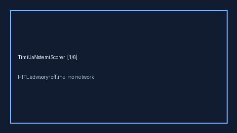

# TimiUaNstemiScorer Guide



Research-only advisory clinical score. Never modifies medications.
Closes MDCalc / ACC / EHR TIMI UA/NSTEMI gaps.

Optional polish via **GPT-5.5 / Claude Sonnet 4.6 / Gemini 3.x / Kimi K2**.

Distinct from `PercPeExclusionScorer / WellsDvtProbabilityScorer`.

## Usage

```python
from medagent.safety.timi_ua_nstemi_scorer import (
    TimiUaNstemiScorer,
    TimiUaNstemiFactors,
)

findings = TimiUaNstemiScorer().check(TimiUaNstemiFactors())
print(findings[0].band, findings[0].score)
```
