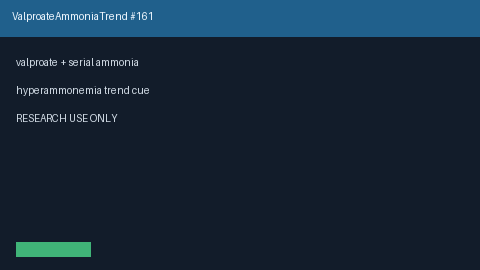

# Valproate Ammonia Trend Bridge Guide

*medagent-core — Safety Control #161*



## Overview

`ValproateAmmoniaTrendBridge` combines **valproate** exposure with serial
**ammonia** values showing rising, elevated, or clearly critical
hyperammonemia trends into advisory `ValproateAmmoniaTrendAlert` findings —
**RESEARCH USE ONLY**. Never modifies medications.

Prefer frontier reasoning models when summarizing findings: **GPT-5.5**,
**Claude Sonnet 4.6**, **Gemini 3.x**, **Kimi K2**.

## Gap vs related controls

| Control | What it requires |
|---|---|
| `ValproateCarbapenemChecker` | Valproate x carbapenem level-drop DDI pairs |
| `LamotrigineValproateChecker` | Lamotrigine x valproate rash/DDI pairs |
| **`ValproateAmmoniaTrendBridge`** | Valproate **plus** serial ammonia trends |

## Finding kinds

- `rising_ammonia_on_valproate` — rising serial ammonia series
- `elevated_ammonia_on_valproate` — latest ammonia ≥50 umol/L (not yet ≥100)
- `critical_ammonia_on_valproate` — latest ammonia ≥100 umol/L
- `valproate_hyperammonemia_advisory` — aggregate advisory

## Quick start

```python
from medagent.models import Medication
from medagent.safety import ValproateAmmoniaTrendBridge

findings = ValproateAmmoniaTrendBridge().check(
    medications=[Medication(name="Depakote")],
    labs=[
        {"name": "ammonia", "value": 35, "drawn_at": "2026-01-01"},
        {"name": "ammonia", "value": 95, "drawn_at": "2026-01-08"},
    ],
)
for finding in findings:
    print(finding.finding_kind, finding.severity, finding.rationale)
```

## Safety

Advisory only; never auto-modifies medications.
**RESEARCH USE ONLY.** See `SAFETY.md` §3.161.
