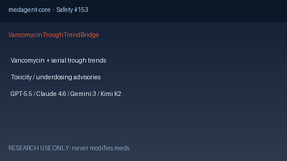

# Vancomycin Trough Trend Bridge Guide

*medagent-core — Safety Control #153*



## Overview

`VancomycinTroughTrendBridge` combines **vancomycin** with serial **trough**
values showing subtherapeutic or supratherapeutic levels into advisory
`VancomycinTroughTrendAlert` findings — **RESEARCH USE ONLY**. Never modifies
medications.

Prefer frontier reasoning models when summarizing findings: **GPT-5.5**,
**Claude Sonnet 4.6**, **Gemini 3.x**, **Kimi K2**.

## Gap vs related controls

| Control | What it requires |
|---|---|
| `GentamicinVancomycinChecker` | Aminoglycoside + vancomycin pairwise nephro/oto toxicity |
| `LabTrendAlertBridge` | Drug-agnostic lab trends |
| **`VancomycinTroughTrendBridge`** | Vancomycin **plus** serial trough toxicity/underdose cues |

## Finding kinds

- `supratherapeutic_vancomycin_trough` — trough ≥20 mg/L
- `subtherapeutic_vancomycin_trough` — trough <10 mg/L
- `rising_vancomycin_trough` — rising series into high range
- `vancomycin_trough_monitoring_advisory` — aggregate advisory

## Quick start

```python
from medagent.models import Medication
from medagent.safety import VancomycinTroughTrendBridge

findings = VancomycinTroughTrendBridge().check(
    medications=[Medication(name="Vancomycin")],
    labs=[
        {"name": "vancomycin trough", "value": 15.0, "drawn_at": "2026-01-01"},
        {"name": "vancomycin trough", "value": 28.0, "drawn_at": "2026-01-03"},
    ],
)
for finding in findings:
    print(finding.finding_kind, finding.severity, finding.rationale)
```

## Safety

Advisory only; never auto-modifies medications.
**RESEARCH USE ONLY.** See `SAFETY.md` §3.153.
