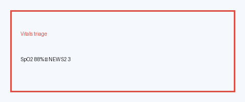

# Vitals Triage Checker Guide

*medagent-core — Safety Control #128*



## Overview

`VitalsTriageChecker` applies **adult NEWS2-style single-parameter bands** to
SpO2, respiratory rate, systolic blood pressure, heart rate, and temperature,
emitting advisory `VitalsTriageRisk` findings with educational NEWS2 scores and
severities. This is **RESEARCH USE ONLY** triage education — not a bedside
early-warning implementation and not a substitute for local NEWS2/MEWS protocols.

The checker is exported from `medagent.safety`. Prefer frontier reasoning models
when summarizing findings: **GPT-5.5**, **Claude Sonnet 4.6**, **Gemini 3.x**,
**Kimi K2**.

## Gap vs MedPrompt clinical triage

MedPrompt-style systems often rely on free-text clinical triage prompting.
This control instead provides a **deterministic, auditable NEWS2 single-parameter
band map** over structured vitals — complementary to LLM triage narratives, not
a replacement for clinician judgment or institutional early-warning pathways.

## Supported parameters (educational NEWS2 Scale-1 style)

| Parameter | Aliases | Score 3 (HIGH) | Score 2 (MODERATE) | Score 1 (LOW) |
|---|---|---|---|---|
| SpO2 | oxygen saturation, o2 sat | ≤91% | 92–93% | 94–95% |
| Respiratory rate | RR | ≤8 or ≥25 | 21–24 | 9–11 |
| Systolic BP | SBP | ≤90 or ≥220 | 91–100 | 101–110 |
| Heart rate | pulse, HR | ≤40 or ≥131 | 111–130 | 41–50 or 91–110 |
| Temperature (°C) | temp | ≤35.0 | ≥39.1 | 35.1–36.0 or 38.1–39.0 |

## Quick start

```python
from medagent.models import VitalSign
from medagent.safety import VitalsTriageChecker

findings = VitalsTriageChecker().check(
    [
        VitalSign(name="SpO2", value=88.0, unit="%"),
        VitalSign(name="heart_rate", value=140.0, unit="/min"),
        VitalSign(name="temperature", value=37.0, unit="C"),
    ]
)
for finding in findings:
    print(finding.parameter, finding.news2_score, finding.severity, finding.rationale)
```

Optional FHIR support: vital-sign Observations may populate
`FHIRPatientContext.vital_signs` via `extraction/fhir_parser.py`.

## Safety

Advisory only; never auto-modifies vitals, orders oxygen, or escalates care.
**RESEARCH USE ONLY.**
