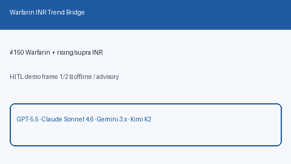

# Warfarin INR Trend Bridge Guide

*medagent-core — Safety Control #150*



## Overview

`WarfarinInrTrendBridge` combines **warfarin** with serial **INR** values
showing a rise and/or a supratherapeutic level into advisory
`WarfarinInrTrendAlert` findings — **RESEARCH USE ONLY**. Never modifies
medications.

Prefer frontier reasoning models when summarizing findings: **GPT-5.5**,
**Claude Sonnet 4.6**, **Gemini 3.x**, **Kimi K2**.

## Gap vs related controls

| Control | What it requires |
|---|---|
| `WarfarinNsaidChecker` | Warfarin + NSAID pairwise DDI |
| `LabTrendAlertBridge` | Rising INR only (drug-agnostic) |
| **`WarfarinInrTrendBridge`** | Warfarin **plus** rising/supratherapeutic INR |

## Finding kinds

- `rising_inr_on_warfarin` — rising INR while on warfarin
- `supratherapeutic_inr_on_warfarin` — INR ≥3.0 while on warfarin
- `warfarin_inr_bleeding_risk` — aggregate bleeding-risk advisory

## Quick start

```python
from medagent.models import Medication
from medagent.safety import WarfarinInrTrendBridge

findings = WarfarinInrTrendBridge().check(
    medications=[Medication(name="Warfarin")],
    labs=[
        {"name": "INR", "value": 2.0, "drawn_at": "2026-01-01"},
        {"name": "INR", "value": 3.8, "drawn_at": "2026-01-08"},
    ],
)
for finding in findings:
    print(finding.finding_kind, finding.severity, finding.rationale)
```

## Safety

Advisory only; never auto-modifies medications.
**RESEARCH USE ONLY.** See `SAFETY.md` §3.150.
