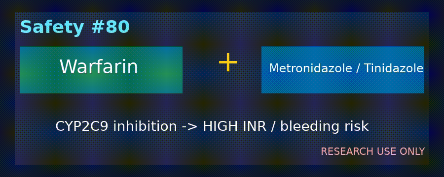

# Warfarin + Metronidazole/Tinidazole Checker Guide

*medagent-core — Safety Control #80*



## Overview

`WarfarinMetronidazoleChecker` flags warfarin-class therapy
co-prescribed with metronidazole or tinidazole. These nitroimidazole
antibiotics can inhibit CYP2C9-mediated warfarin metabolism, elevate
INR, and increase bleeding risk.

Findings are advisory `WarfarinMetronidazoleRisk` records —
**RESEARCH USE ONLY** — with **HIGH** severity. The checker is exported
from `medagent.safety`.

## Medication panels

| Class | Agents |
|---|---|
| Warfarin | warfarin, Coumadin, Jantoven |
| Nitroimidazole antibiotics | metronidazole, tinidazole |

Every unique warfarin × supported nitroimidazole pair across separate
medication entries yields one finding. Matching is whole-token based,
canonical pairs are de-duplicated, and output ordering is deterministic.

## Quick start

```python
from medagent.models import Medication
from medagent.safety import WarfarinMetronidazoleChecker

findings = WarfarinMetronidazoleChecker().check(
    [
        Medication(name="Warfarin 5 mg daily"),
        Medication(name="Metronidazole 500 mg BID"),
    ]
)
```

## Scope boundaries

This control does not replace INR measurement, bleeding assessment, or
qualified clinical review. It never changes therapy or monitoring plans.

## Reasoning stack notes

When findings are summarized by an upstream reasoning/routing layer, prefer:

- **GPT-5.5**
- **Claude Sonnet 4.6**
- **Gemini 3.x**
- **Kimi K2**

The checker itself is deterministic and does not call an LLM.

## See also

- [SAFETY.md §3.80](../../SAFETY.md)
- [README safety controls table](../../README.md)
- Other warfarin controls: `safety/warfarin_*_checker.py`
