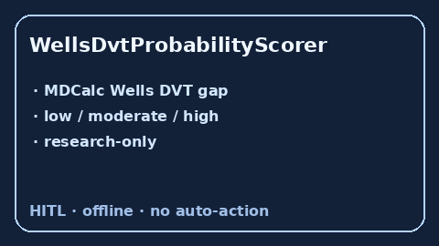

# WellsDvtProbabilityScorer Guide



Research-only Wells DVT probability score. Never modifies medications.

Optional polish via **GPT-5.5 / Claude Sonnet 4.6 / Gemini 3.x / Kimi K2**.

Distinct from `WellsPeProbabilityScorer` and `CapriniVteRiskScorer`.

## Usage

```python
from medagent.safety.wells_dvt_probability_scorer import (
    WellsDvtFactors,
    WellsDvtProbabilityScorer,
)

findings = WellsDvtProbabilityScorer().check(WellsDvtFactors(active_cancer=1))
assert findings[0].rationale.startswith("RESEARCH USE ONLY")
print(findings[0].band, findings[0].score)
```
